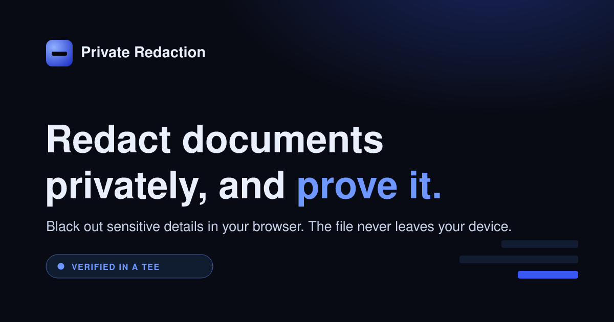

<p align="center">
  
</p>

<h1 align="center">Private Redaction</h1>

<p align="center">
  Redact sensitive information from documents in your browser, with cryptographic proof the AI that scanned them ran privately.
</p>

<p align="center">
  <a href="https://privateredact.app"><b>privateredact.app</b></a>
</p>

---

Private Redaction blacks out names, emails, phone numbers, addresses, IDs, card numbers and any custom terms in PDF, DOCX and TXT files. Your document is opened and redacted **entirely on your own device**. The file is never uploaded. To find what's sensitive, the extracted text is sent **straight from your browser to a private AI running inside a hardware-sealed enclave**, it doesn't pass through this app's own server, and every run is verified against that enclave's attestation. So instead of trusting a promise that your document stayed private, you get to check it.

Free, no sign-up, runs in the browser.

## Why it's private

- **The file never leaves your device.** Extraction, redaction and PDF generation all happen client-side. Only the extracted *text* is sent for analysis, the document itself is never uploaded.
- **The AI runs in a sealed enclave.** Detection is performed by [Nillion nilAI](https://docs.nillion.com/build/private-llms/overview), a private LLM running inside an AMD SEV-SNP Trusted Execution Environment, hardware that the operator, the model host and the cloud provider cannot see into.
- **The text goes straight to the enclave.** On the default path the browser mints a short-lived, single-use delegation token from our server (which only ever sees a public key, never the text) and then calls the enclave **directly**. The document text never passes through this app's own server. If that path is unavailable it falls back to a stateless relay, and the UI states which path each run used.
- **Verifiable, not asserted.** Every run is checked against the enclave's hardware attestation and a per-response signature, and the result is shown alongside your redaction.
- **Real redaction.** Redacted content is removed from the output, not just visually covered; there is no hidden text layer to recover.

## How it works

Default (direct) path, the document text never touches our server:

```
Browser
  file ──(read locally; never uploaded)──▶ extracted text
  browser ──(public key only)──▶ /api/token ──▶ short-lived delegation token
  text + token ─────────────────────────────▶ private LLM in a TEE   ← direct; text bypasses our server
                                              ◀── detected items (+ response signature)
  /api/attest ──▶ SEV-SNP attestation (AMD chain), text-free ──▶ verification result + receipt
  redact + rebuild the PDF locally, show the preview + verification
```

Fallback (relay) path, used only if the direct path is unavailable:

```
  text ──▶ /api/verify (serverless) ──▶ private LLM in a TEE ──▶ detected items + verification
```

Text detection uses a mix of local pattern rules (emails, phone numbers, card numbers, IDs, etc.) and the private LLM (names, organisations, addresses, and free-text instructions). `/api/token` mints the delegation token from the server-side API credential (it never receives the text); `/api/attest` runs a dependency-free AMD SEV-SNP attestation check (also text-free). The browser calls the enclave directly with the delegation token, and verifies the response signature (secp256k1) client-side.

## What the verification checks

- **Response signature**, the specific response was signed inside the enclave (secp256k1 ECDSA), verified against the enclave's public key (client-side, in your browser, on the direct path).
- **Enclave attestation**, the AMD SEV-SNP attestation report is verified against AMD's certificate chain (root → intermediate → chip key), along with the report signature, the firmware/TCB versions, that debug mode is off, the launch measurement, and that the report is bound to the live session.

## Redaction output

- **PDF:** each page is rendered to an image, opaque boxes are painted over the sensitive spans, and the PDF is rebuilt from those images; the output contains no text objects, so nothing can be copied back out.
- **DOCX / TXT:** rebuilt as a clean PDF with the redacted spans removed.

## Run your own

The frontend is static and the API credential stays server-side. The browser only ever calls same-origin functions: `/api/token` (mints a delegation token from a public key), `/api/attest` (text-free attestation), and `/api/verify` (relay fallback). The document text goes from the browser directly to the enclave using the delegation token.

You'll need a Nillion nilAI API key. Then, on Netlify (or any host with serverless functions):

1. Deploy the repo. `netlify.toml` sets the publish and functions directories and the `/api/*` routes.
2. Set `NILAI_DELEGATION_KEY` to a Nillion **hex private key** (Direct/Delegated signing credential, e.g. from [nilpay](https://nilpay.vercel.app/)), this is what mints delegation tokens for the direct path. A plain UUID API key can't mint delegations.
3. Optionally set `NILAI_API_KEY` (a UUID Bearer key) to power the relay fallback. Attestation needs no key.
4. Set `ALLOWED_ORIGIN` to your site's origin(s) so the functions aren't open to other sites. Optionally set `DELEGATION_TTL_SEC` (default 20) and `DELEGATION_MAX_USES` (default 1).

The token function `netlify/functions/token.mjs` is a **pre-built** bundle (the nilAI SDK's dependency chain can't be re-bundled by Netlify's esbuild); regenerate it with `scripts/nilai-client-build/`. For local development, `netlify dev` serves the site and functions together; put your key in a local `.env`.

## Notes & limitations

- **Automated redaction is not infallible.** It can miss things or over-cover; always review the preview before relying on or sharing the output.
- **The text goes directly to the enclave on the default path.** The file stays on your device, and the extracted text is sent straight from your browser to the enclave using a delegation token, it doesn't pass through this app's server. If the direct path is unavailable, the tool falls back to relaying the text through its own stateless function; the UI shows which path each run used. The sealed, unreadable property is a guarantee about the enclave itself.
- **PDF output is image-based**, so the redacted document's text is no longer selectable or searchable, the trade-off that guarantees true removal.
- This is an early, evolving tool provided **as is**, without warranty. See the [Terms of Use](https://privateredact.app/terms.html).

## Built with

- [Nillion nilAI](https://docs.nillion.com/build/private-llms/overview), private LLM inference inside a TEE
- [pdf.js](https://mozilla.github.io/pdf.js/), [pdf-lib](https://pdf-lib.js.org/), [mammoth](https://github.com/mwilliamson/mammoth.js), in-browser document handling

## License

[MIT](LICENSE)
